# Parchart — V1 Domain Model

**Status:** Source of truth for the V1 data model. Supersedes ad-hoc sketches in conversation.
**Scope:** V1 only (Collection-first wedge; foundation for a social-heavy V2). Deferred items are named explicitly at the end, not implied.

---

## Conventions

- Every entity has a surrogate `id` PK (UUID) and `created_at` / `updated_at` timestamps unless noted otherwise.
- **`DERIVED`** marks a field that is a cached projection of other data, not an authoritative source. It carries a maintenance rule.
- **`SEAM`** marks structure included now but populated/exercised later, to avoid a future migration.
- Per-actor relations (CollectionItem, Visited, Review) are keyed on the `(account, place)` pair; uniqueness is the idempotency contract.
- Names are singular nouns (ER convention).

---

## ER diagram

```mermaid
erDiagram
    Account ||--o| Profile : "has"
    Account ||--o{ CollectionItem : "saves"
    Account ||--o{ Visited : "logs"
    Account ||--o{ Review : "writes"
    Account ||--o{ Itinerary : "creates"
    Account ||--o{ UserEvent : "generates"
    Account ||--o{ Relationship : "initiates (from_account)"
    Account ||--o{ Relationship : "receives (to_account)"
    Account ||--o{ LlmInteractionLog : "triggers"

    Profile ||--o{ ProfilePreference : "declares"
    Profile ||--o{ ProfileEmbedding : "vectorized as"
    Profile }o--|| VisibilityStatus : "visibility"
    Profile ||--|| ProfileDocument : "described by"

    Place ||--o{ PlaceImage : "has"
    Place ||--o| PlaceDocument : "described by"
    Place ||--o{ PlaceEmbedding : "vectorized as"
    Place ||--o{ PlaceTag : "tagged"
    Place ||--o{ CollectionItem : "saved in"
    Place ||--o{ Visited : "visited in"
    Place ||--o{ Review : "reviewed in"
    Place ||--o{ ItineraryStop : "stop at"

    Tag ||--o{ PlaceTag : "applied via"
    Tag ||--o{ ProfilePreference : "referenced by"

    Itinerary ||--o{ ItineraryStop : "contains"

    CollectionItem }o--|| VisibilityStatus : "visibility"
    Itinerary }o--|| VisibilityStatus : "visibility"

    Account {
        uuid id PK
        string email UK
        boolean email_verified
        string username UK
        string password_hash "hashed + salted, never encrypted"
        boolean onboarding_complete
        timestamp created_at
        timestamp updated_at
    }

    Profile {
        uuid id PK
        uuid account_id FK "unique (1:1)"
        string bio
        text description
        string avatar_url
        int visibility_id FK
        timestamp created_at
        timestamp updated_at
    }

    ProfilePreference {
        uuid id PK
        uuid profile_id FK
        uuid tag_id FK
        string kind "hard | soft"
        float weight "nullable"
        timestamp created_at
    }

    PlaceDocument {
        uuid id PK
        uuid profile_id FK "unique (1:1)"
        text text "embedding source; change invalidates ProfileEmbedding"
        timestamp updated_at
    }

    ProfileEmbedding {
        uuid id PK
        uuid profile_id FK
        string model_id "provider + version"
        vector embedding "From ProfileDocument populated by profiling pipeline (US10)"
        timestamp updated_at
    }

    Place {
        uuid id PK
        string name
        text description
        geography coordinates "Point, SRID 4326, GiST index"
        string address
        int price_level
        float rating "DERIVED from Review"
        int review_count "DERIVED from Review"
        timestamp created_at
        timestamp updated_at
    }

    PlaceImage {
        uuid id PK
        uuid place_id FK
        string url
        int position
        timestamp created_at
    }

    PlaceDocument {
        uuid id PK
        uuid place_id FK "unique (1:1)"
        text text "embedding source; change invalidates PlaceEmbedding"
        timestamp updated_at
    }

    PlaceEmbedding {
        uuid id PK
        uuid place_id FK
        string model_id "provider + version"
        vector embedding
        timestamp created_at
    }

    Tag {
        uuid id PK
        string type "e.g. cuisine, ambiance, activity, accesibility"
        string label
        timestamp created_at
    }

    PlaceTag {
        uuid place_id FK
        uuid tag_id FK
    }

    CollectionItem {
        uuid id PK
        uuid account_id FK
        uuid place_id FK
        int visibility_id FK
        timestamp created_at
    }

    Visited {
        uuid id PK
        uuid account_id FK
        uuid place_id FK
        timestamp visited_at
        timestamp created_at
    }

    Review {
        uuid id PK
        uuid account_id FK
        uuid place_id FK
        int rating
        text content
        timestamp created_at
        timestamp updated_at
    }

    Relationship {
        uuid id PK
        uuid from_account_id FK
        uuid to_account_id FK
        string type "friend | follow"
        string status "pending | accepted | blocked"
        timestamp created_at
        timestamp updated_at
    }

    Itinerary {
        uuid id PK
        uuid account_id FK
        string name
        date scheduled_date "nullable"
        int visibility_id FK
        timestamp created_at
        timestamp updated_at
    }

    ItineraryStop {
        uuid id PK
        uuid itinerary_id FK
        uuid place_id FK
        int sequence
        timestamp created_at
    }

    UserEvent {
        uuid id PK
        uuid account_id FK "nullable (pre-auth)"
        string anonymous_id
        string session_id
        string event_type
        jsonb payload
        jsonb context
        timestamp occurred_at
    }

    VisibilityStatus {
        int id PK
        string code "public | friends | private"
        string label
    }

    LlmInteractionLog {
        uuid id PK
        uuid account_id FK "nullable"
        string interaction_type "recommendation | profiling"
        string prompt_version
        string provider
        string model
        jsonb request_payload
        jsonb raw_response
        jsonb parsed_output
        string outcome
        timestamp created_at
    }
```

> **Friendship** is intentionally **not** a physical table here. In the recommended design it is a *derived* concept: a reciprocal pair of accepted `Relationship` rows (`A→B` and `B→A`, `type=friend`, `status=accepted`). See open decision #2.

---

## Design decisions
- Friendship is derived from relationship type, so later there can also be follows to recommender profiles or businesses.
- Account for authentication, Profile for Collection/Recommendation/Social. Later accounts claim business profiles (roles).
- Deferred ProfileDocument generation through Llm pipeline.
- Deferred on Document change -> embedding update.
- ProfilePreference hard (For user preferences that derive exclusion like accessibility needs, alergies) soft deferred? PlaceDocument does this?
- Visited is a log(append only), a place cannot be "Unvisited".
- Review moderation status for later.
- Place curation status for later.
- Deferred notifications
- Event and Llm Logging are asynchronous, use JSON for flexibility
- VisibilityStatus is master lookup table
- Embeddings are anchored to source objects not documents
- Single collection per user
- Deferred authentication strategy
- Deferred feed infrastructure (fan out on read vs on write) For trending implementation: Define concept for limited magazine type feed

---

## References

- PostGIS — Geography type, SRID 4326, GiST indexing, `ST_DWithin`: <http://postgis.net/workshops/postgis-intro/geography.html>
- pgvector — per-model embedding tables, dimension handling, partial indexes: <https://github.com/pgvector/pgvector/blob/master/README.md>
- OWASP — Password Storage Cheat Sheet (hash + salt, not encryption): <https://cheatsheetseries.owasp.org/cheatsheets/Password_Storage_Cheat_Sheet.html>
- Martin Fowler — event log vs application state: <https://martinfowler.com/articles/201701-event-driven.html>
- Mermaid — Entity Relationship Diagram syntax: <https://github.com/mermaid-js/mermaid/blob/develop/docs/syntax/entityRelationshipDiagram.md>